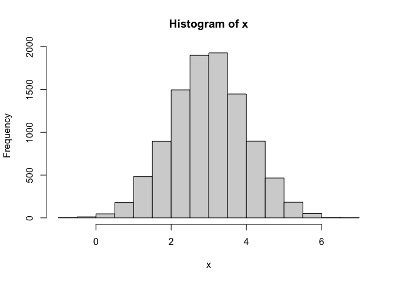
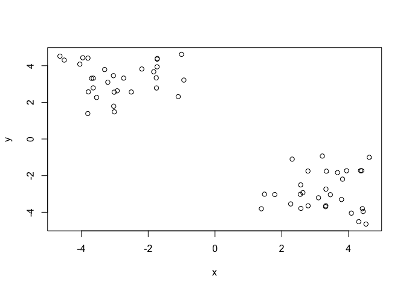
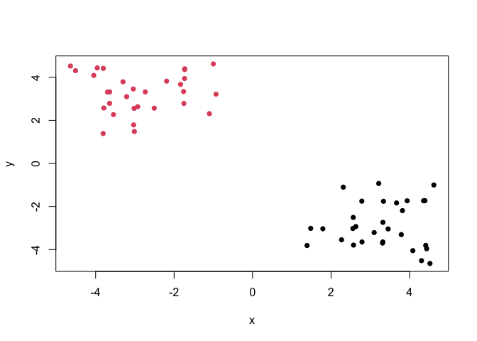
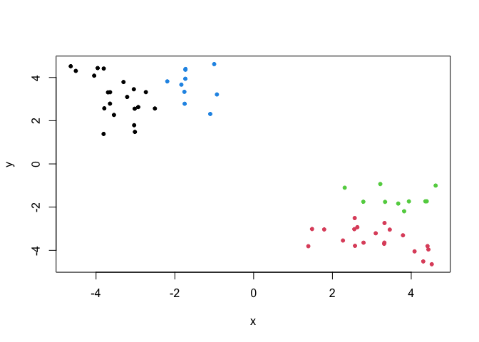
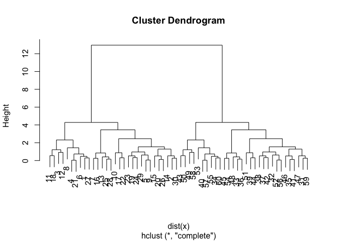
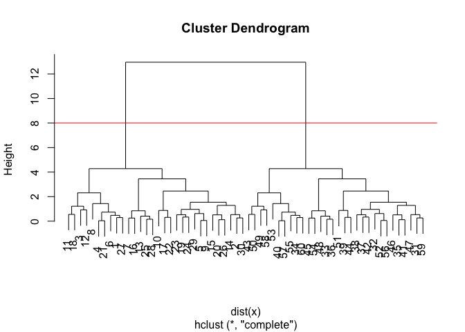
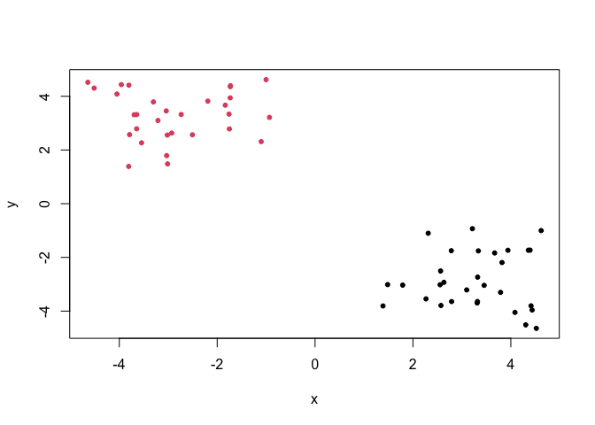
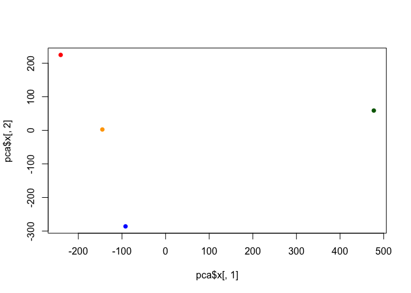
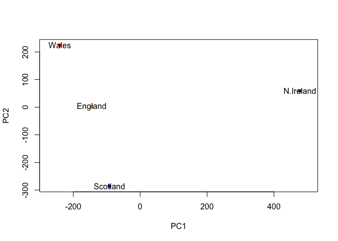
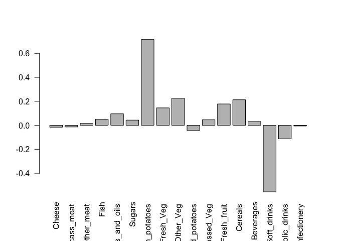

# Class 07: Machine Learning 1
Alvin Cheng (A16840171)

\#clustering

We will start today’s lab with clustering methods, in particular
so-called K-means. The main function for this in R is `kmeans()`.

Let’s try it on some made up data where we know what the answer should
be. This will allow us to determine if the function is working properly.

``` r
x <- rnorm(10000, mean = 3)
hist(x)
```



60 points

``` r
tmp <- c(rnorm(30, mean=3), rnorm(30,-3)) #mean = -3 is optional
x<- cbind(x=tmp, y=rev(tmp)) #rev reverses order 
head(x)
```

                x         y
    [1,] 3.940257 -1.734327
    [2,] 2.789279 -3.645380
    [3,] 2.311299 -1.101255
    [4,] 4.392867 -1.730213
    [5,] 3.312272 -3.696688
    [6,] 3.819785 -2.191721

We can pass this to base R `plot()` function for a quick look. Not going
to use ggplot this time. base R works

``` r
plot(x)
```



``` r
k <- kmeans(x,centers =2, nstart=20)
k
```

    K-means clustering with 2 clusters of sizes 30, 30

    Cluster means:
              x         y
    1  3.284774 -2.855140
    2 -2.855140  3.284774

    Clustering vector:
     [1] 1 1 1 1 1 1 1 1 1 1 1 1 1 1 1 1 1 1 1 1 1 1 1 1 1 1 1 1 1 1 2 2 2 2 2 2 2 2
    [39] 2 2 2 2 2 2 2 2 2 2 2 2 2 2 2 2 2 2 2 2 2 2

    Within cluster sum of squares by cluster:
    [1] 56.89337 56.89337
     (between_SS / total_SS =  90.9 %)

    Available components:

    [1] "cluster"      "centers"      "totss"        "withinss"     "tot.withinss"
    [6] "betweenss"    "size"         "iter"         "ifault"      

> Q1. How many points are in each cluster?

``` r
k$size
```

    [1] 30 30

> Q2 Cluster membership?

``` r
k$cluster
```

     [1] 1 1 1 1 1 1 1 1 1 1 1 1 1 1 1 1 1 1 1 1 1 1 1 1 1 1 1 1 1 1 2 2 2 2 2 2 2 2
    [39] 2 2 2 2 2 2 2 2 2 2 2 2 2 2 2 2 2 2 2 2 2 2

> Q3. Cluster Centers?

``` r
k$centers
```

              x         y
    1  3.284774 -2.855140
    2 -2.855140  3.284774

> Q4. Plot my clustering results

``` r
#plot(x, col= c("blue", "red"))
plot(x,col=k$cluster, pch=16) #pch gives different shapes for the point 
```



> Q5 Cluster the data again into 4 groups with kmeans() and plot the
> results

``` r
a <- kmeans(x,centers = 4, nstart=20)
plot(x,col=a$cluster, pch=20) #pch gives different shapes for the point 
```



K-means is very popular mostly because it is fast and relatively
straightforward to run and understand. It has a big limitation in that
you need to tell it how many groups (k, or centers) you want.

# Hierarchical Clustering

The main function in base R is called `hclust()`. You have to pass it in
a “distance matrix” not just your input data.

You can generate a distance matrix with the `dist()` function.

``` r
hc <- hclust(dist(x))
hc
```


    Call:
    hclust(d = dist(x))

    Cluster method   : complete 
    Distance         : euclidean 
    Number of objects: 60 

``` r
plot(hc)
```



To find the clusters (cluster membership vector) from a `hcluster()`
result we can “cut” the tree at a certain height that we like.

``` r
plot(hc)
abline(h=8, col="red")
```



``` r
grps <- cutree(hc, h =8)
```

``` r
table(grps)
```

    grps
     1  2 
    30 30 

> Q6 Plot our hclust results.

``` r
plot(x, col=grps, pch = 20)
```



## PCA of UK food data

Suppose that we are examining the following data, from the UK’s
‘Department for Environment, Food and Rural Affairs’ (DEFRA), showing
the consumption in grams (per person, per week) of 17 different types of
food-stuff measured and averaged in the four countries of the United
Kingdom in 1997.

Let’s see how PCA can help us but first we can try conventional analysis

``` r
url <- "https://tinyurl.com/UK-foods"
x <- read.csv(url)
x
```

                         X England Wales Scotland N.Ireland
    1               Cheese     105   103      103        66
    2        Carcass_meat      245   227      242       267
    3          Other_meat      685   803      750       586
    4                 Fish     147   160      122        93
    5       Fats_and_oils      193   235      184       209
    6               Sugars     156   175      147       139
    7      Fresh_potatoes      720   874      566      1033
    8           Fresh_Veg      253   265      171       143
    9           Other_Veg      488   570      418       355
    10 Processed_potatoes      198   203      220       187
    11      Processed_Veg      360   365      337       334
    12        Fresh_fruit     1102  1137      957       674
    13            Cereals     1472  1582     1462      1494
    14           Beverages      57    73       53        47
    15        Soft_drinks     1374  1256     1572      1506
    16   Alcoholic_drinks      375   475      458       135
    17      Confectionery       54    64       62        41

> Q1. How many rows and columns are in your new data frame named x? What
> R functions could you use to answer this questions?

17 and 5

``` r
dim(x)
```

    [1] 17  5

``` r
# prints out rows and columns 
head(x) # checking the first 6 data
```

                   X England Wales Scotland N.Ireland
    1         Cheese     105   103      103        66
    2  Carcass_meat      245   227      242       267
    3    Other_meat      685   803      750       586
    4           Fish     147   160      122        93
    5 Fats_and_oils      193   235      184       209
    6         Sugars     156   175      147       139

``` r
#View(x)
```

``` r
# Note how the minus indexing works.
# remember to rerun the URL 
rownames(x) <- x[,1]
#head(x) # the code above will reprint the column X again, as such you want to remove the first column to maintain the same table
x <- x[,-1] # removes column continually because it overwrites it 
head(x) #this should print the table with the appropriate rows and columns
```

                   England Wales Scotland N.Ireland
    Cheese             105   103      103        66
    Carcass_meat       245   227      242       267
    Other_meat         685   803      750       586
    Fish               147   160      122        93
    Fats_and_oils      193   235      184       209
    Sugars             156   175      147       139

``` r
dim(x)
```

    [1] 17  4

> Q2. Which approach to solving the ‘row-names problem’ mentioned above
> do you prefer and why? Is one approach more robust than another under
> certain circumstances?

I prefer the one below because the other approach above can overwrite x
and continually delete the data in each column

``` r
x <- read.csv(url, row.names=1)
head(x)
```

                   England Wales Scotland N.Ireland
    Cheese             105   103      103        66
    Carcass_meat       245   227      242       267
    Other_meat         685   803      750       586
    Fish               147   160      122        93
    Fats_and_oils      193   235      184       209
    Sugars             156   175      147       139

``` r
barplot(as.matrix(x), beside=T, col=rainbow(nrow(x)))
```


> Q3: Changing what optional argument in the above barplot() function
> results in the following plot?

Changing beside to false will stack up the bars into one group rather
than display the bars side by side

``` r
barplot(as.matrix(x), beside=F, col=rainbow(nrow(x)))
```


> Q5: Generating all pairwise plots may help somewhat. Can you make
> sense of the following code and resulting figure? What does it mean if
> a given point lies on the diagonal for a given plot?

`pairs()` produces a matrix of scatterplots in which you can compare
different graphs. For example, you can compare the data of England in
Row 1, Column 2 or in Row 2, Column 1. Note that the axis are flipped in
the bottom diagonal left from the top diagonal right graphs If a given
point lies on the diagonal, the consumption of food are the same or at
least roughly similar between the two countries.

``` r
pairs(x, col=rainbow(10), pch=16)
```


> Q6. What is the main differences between N. Ireland and the other
> countries of the UK in terms of this data-set?

Northern Ireland has much more clumped data together of food consumption
compared to the other 3 countries in the UK which has a more linear
association of data throughout.

# Principal Component Analysis (PCA)

PCA can help us make sense of these types of datasets. Let’s see how it
works. The main function in “base” R is called `prcomp()`. In this case,
we want to first take the transpose `t()` of our input `x` so the
columns are the food types and the countries are the rows.

``` r
head( t(x) )
```

              Cheese Carcass_meat  Other_meat  Fish Fats_and_oils  Sugars
    England      105           245         685  147            193    156
    Wales        103           227         803  160            235    175
    Scotland     103           242         750  122            184    147
    N.Ireland     66           267         586   93            209    139
              Fresh_potatoes  Fresh_Veg  Other_Veg  Processed_potatoes 
    England               720        253        488                 198
    Wales                 874        265        570                 203
    Scotland              566        171        418                 220
    N.Ireland            1033        143        355                 187
              Processed_Veg  Fresh_fruit  Cereals  Beverages Soft_drinks 
    England              360         1102     1472        57         1374
    Wales                365         1137     1582        73         1256
    Scotland             337          957     1462        53         1572
    N.Ireland            334          674     1494        47         1506
              Alcoholic_drinks  Confectionery 
    England                 375             54
    Wales                   475             64
    Scotland                458             62
    N.Ireland               135             41

``` r
pca <- prcomp( t(x))
summary(pca)
```

    Importance of components:
                                PC1      PC2      PC3       PC4
    Standard deviation     324.1502 212.7478 73.87622 5.552e-14
    Proportion of Variance   0.6744   0.2905  0.03503 0.000e+00
    Cumulative Proportion    0.6744   0.9650  1.00000 1.000e+00

``` r
pca$x
```

                     PC1         PC2         PC3           PC4
    England   -144.99315    2.532999 -105.768945  1.042460e-14
    Wales     -240.52915  224.646925   56.475555  9.556806e-13
    Scotland   -91.86934 -286.081786   44.415495 -1.257152e-12
    N.Ireland  477.39164   58.901862    4.877895  2.872787e-13

``` r
plot(pca$x[,1],pca$x[,2],
     col = c("orange", "red", "blue", "darkgreen"),
     pch=16) #comparing first and second column
```



``` r
#shows 4 points
```

> Q7. Complete the code below to generate a plot of PC1 vs PC2. The
> second line adds text labels over the data points.

``` r
plot(pca$x[,1], pca$x[,2], xlab = "PC1", ylab = "PC2", xlim=c(-270,500))
text(pca$x[,1], pca$x[,2], colnames(x))
```


> Q8. Customize your plot so that the colors of the country names match
> the colors in our UK and Ireland map and table at start of this
> document.

``` r
plot(pca$x[,1], pca$x[,2], xlab = "PC1", ylab = "PC2", xlim=c(-270,500),
     col = c("orange", "red", "blue", "darkgreen"),
     pch=16)
text(pca$x[,1], pca$x[,2], colnames(x))
```



``` r
v <- round( pca$sdev^2/sum(pca$sdev^2) * 100 )
v
```

    [1] 67 29  4  0

``` r
## or the second row here...
z <- summary(pca)
z$importance
```

                                 PC1       PC2      PC3          PC4
    Standard deviation     324.15019 212.74780 73.87622 5.551558e-14
    Proportion of Variance   0.67444   0.29052  0.03503 0.000000e+00
    Cumulative Proportion    0.67444   0.96497  1.00000 1.000000e+00

``` r
barplot(v, xlab="Principal Component", ylab="Percent Variation")
```


``` r
## Lets focus on PC1 as it accounts for > 90% of variance 
par(mar=c(10, 3, 0.35, 0))
barplot( pca$rotation[,1], las=2 )
```


> Q9: Generate a similar ‘loadings plot’ for PC2. What two food groups
> feature prominantely and what does PC2 maninly tell us about?

Potatoes and soft drinks feature predominantly. PC2 shows the second
most variance in the food data for the countries. This extracts the food
between the countries that has the second most spread in the data. Soda
and potatoes varied the second most in food for the four countries.

``` r
barplot( pca$rotation[,2], las=2 )
```


